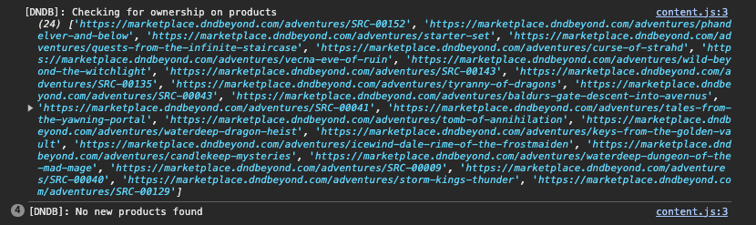

# D&D Beyond Product Ownership

Chrome extension that shows which D&D Beyond marketplace products you don't own yet. Opens as a side panel so you can browse and click through to products without losing your place.

## Features

- Cross-references three ownership sources: marketplace API, dndbeyond.com/account/licenses, and order history
- Matches products by ID, variant ID, and license name fallback
- Filters by format (Digital / Physical / All) and category (Sourcebooks, Adventures, Dice, etc.)
- Filter preferences persist across sessions
- Daily caching with manual refresh
- Detects bundle ownership (all children owned = bundle owned)

## Install

1. Download or clone this repo
2. Go to `chrome://extensions/` and enable Developer Mode
3. Click **Load Unpacked** and select the repo folder
4. Navigate to [marketplace.dndbeyond.com](https://marketplace.dndbeyond.com) while logged in
5. Click the extension icon to open the side panel

## Usage

- The extension syncs automatically when you visit the marketplace
- Click the extension icon to open the side panel with your "not owned" list
- Click any product to open its marketplace page
- Use the format toggle (Digital / Physical / All) to filter by product type
- Click category chips to hide/show groups
- Hit **Refresh** to re-sync from all sources
